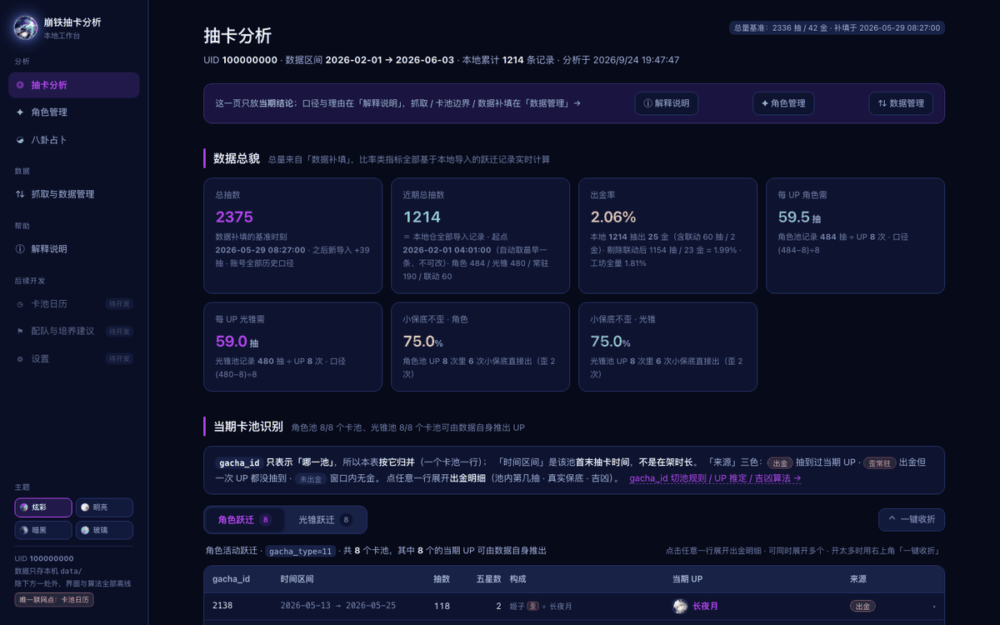
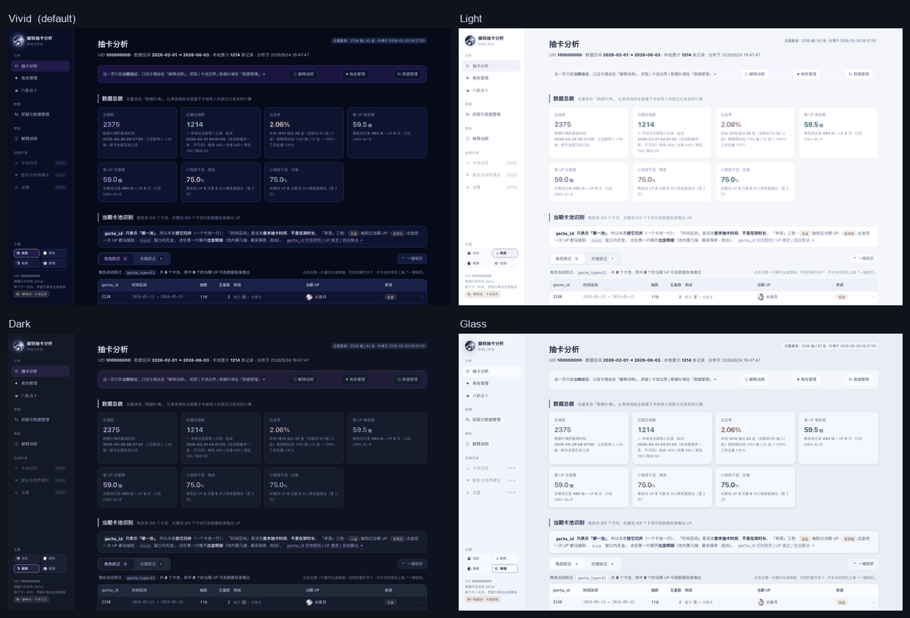
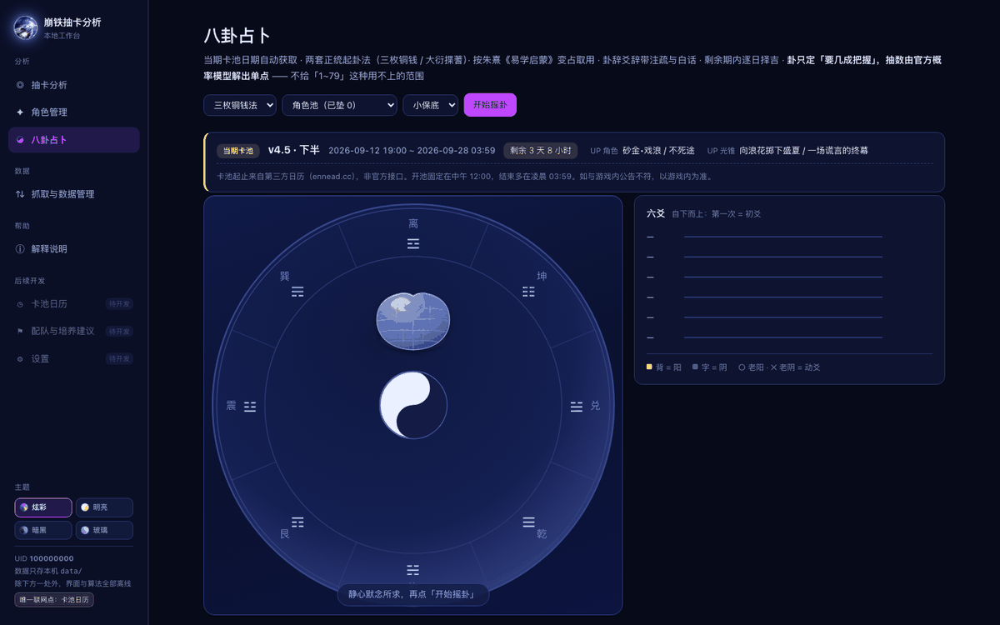
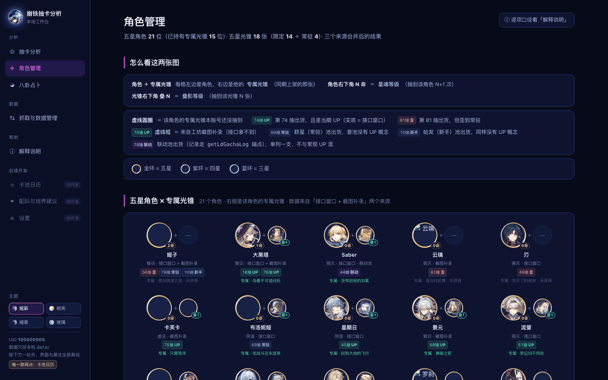

<div align="center">

# Star Rail Warp Analyzer

**A local-first tracker and analyzer for your Honkai: Star Rail warp history.**
Pull rates, pity progress, and every limited 5★ you own — computed on your own machine, from records you can audit line by line.



<sub>Fictional demo data. The app runs entirely on <code>127.0.0.1</code> and uploads nothing.</sub>

[](LICENSE)
[](https://github.com/FelixAstra/star-rail-analysis/actions/workflows/ci.yml)
[](https://github.com/FelixAstra/star-rail-analysis/releases/latest)
[](https://nodejs.org)
[](#quick-start)

</div>

> **The app UI is in Simplified Chinese.** This README, the code and the CLI are in English.
>
> **Unofficial fan project.** Not affiliated with or endorsed by miHoYo / HoYoverse. It reads the official endpoint using your own account credentials, nothing more — see [Credits & disclaimer](#credits--disclaimer).

---

## Why this one?

Web-based warp trackers ask you to hand your `authkey` to a third-party server. This one is a single Node process bound to `127.0.0.1` that never sends your records anywhere.

- **Local by default.** No account, no telemetry, no upload. Your records sit in `data/`, which is git-ignored and stays on your disk.
- **Your history grows, it never shrinks.** The official API only serves a sliding window of roughly one year. Every import is merged into the local archive by record `id`, so older pulls survive as the window rolls forward.
- **Handles both gacha endpoints.** Limited (collab) banners are served by a *second* endpoint. Query only the usual one and you get **zero rows with `retcode: 0`** — no error, just a whole banner silently missing.
- **Numbers you can check by hand.** Every rate is derived only from imported records you can open and audit, and the in-app handbook documents each formula.
- **A divination page, kept honest.** A full six-line (六爻) casting engine, auspicious-hour scoring, and a recommended pull count that comes from gacha pity maths — never from the hexagram. See [Divination](#divination).

## Quick start

**Requirements:** [Node.js](https://nodejs.org) 18 or newer. That is the whole list — there is **no `npm install`**, because the project has zero runtime dependencies (Vue 3 and the lunar-calendar engine are vendored).

**No git? Grab the zip**

Download [`star-rail-analysis.zip`](https://github.com/FelixAstra/star-rail-analysis/releases/latest/download/star-rail-analysis.zip), unzip it, and double-click the launcher inside (`start.command` on macOS, `start.bat` on Windows). It ships with an **empty** `data/` folder — your first import creates your archive.

**macOS / Linux**

```bash
git clone https://github.com/FelixAstra/star-rail-analysis.git
cd star-rail-analysis
./start.command          # or just double-click start.command in Finder
```

It starts a local server, opens your browser, and stops when you close the terminal window.

> On first launch macOS may refuse to open it ("unidentified developer"). Allow it once under **System Settings → Privacy & Security → Open Anyway**. `start.command` is a plain shell script — read it before you trust it.

**Windows**

```bat
git clone https://github.com/FelixAstra/star-rail-analysis.git
cd star-rail-analysis
start.bat
```

`start.bat` opens a console window, starts the server, launches your browser, and stops when you close that window. The launcher logic itself is cross-platform (`tools/launch.js`, fully exercised on macOS/Linux); the `.bat` wrapper is intentionally a few lines of plain batch, but it has **not yet been verified on a real Windows machine** — if it misbehaves, please open an issue, or fall back to:

```bat
node tools\launch.js
```

All platforms: the server prints its URL in the console (`http://127.0.0.1:8799/`; if that port is busy it steps up to the next free one and writes the real port to `.port`). The first launch downloads the game icon set (a few MB) in the background.

### Want to see it populated first?

A fresh clone (or zip) has no account data, so the screens are empty. Generate a fictional demo account:

```bash
node tools/make-demo-data.js
```

That writes a synthetic UID (`100000000`) and about 1,200 warp records spanning roughly four months, covering five of the six banner types (the beginner pool is represented only by a screenshot backfill).

> The script refuses to run if `data/records.json` already exists. To overwrite anyway, use `node tools/make-demo-data.js --force` — it first copies `records.json`, `meta.json`, `account.json` and `external.json` into `data/_demo-backup-<timestamp>/`.

## Importing your warps

In game: **Warp → View Details → Share**, then copy the link. It looks like `...api/getGachaLog?authkey=...`. Paste the whole thing into **Data & Import** — the `end_id` and `page` parameters are ignored.

Importing walks all six pools **sequentially**, switching endpoint by banner type — and that detail matters:

| Banner | `gacha_type` | Endpoint |
|---|---|---|
| Stellar Warp (standard) | `1` | `getGachaLog` |
| Departure Warp (beginner) | `2` | `getGachaLog` |
| Character Event Warp | `11` | `getGachaLog` |
| Light Cone Event Warp | `12` | `getGachaLog` |
| **Character Collab Warp** | `21` | **`getLdGachaLog`** |
| **Light Cone Collab Warp** | `22` | **`getLdGachaLog`** |

> Collab banners answer on a different endpoint. Query only the common one and the result is **0 rows with `retcode: 0`** — indistinguishable from "you never pulled here", while the entire banner is dropped.

### Imports are additive, never destructive

- The **first** import becomes the foundation of your local archive.
- Every **later** import only adds records that are not already there, deduplicated by record `id`. Each import reports how many rows came in and how many were new.
- Raw responses are archived to `data/snapshots/`, so you can always trace which import produced what.

Because of this, your local coverage ends up **longer than any single fetch** — which is why old pulls don't disappear when the API's window rolls forward.

> The official API keeps about **one year** of history. To rebuild anything older, keep syncing over time or import a UIGF / SRGF file. No tool can recover pre-window history from a URL — the data is gone server-side.

Each import also refreshes the **name / path index** and downloads any **missing character avatars and light cone icons** (validated by PNG magic bytes, not just "the file exists").

## Data & privacy

This repository contains **no real player data**. Here is the full inventory:

| Path | Committed | What it is |
|---|---|---|
| `data/records.json` | No | Every warp record plus your UID — the single source of truth |
| `data/meta.json` | No | UID, nickname, manual baseline and edit history |
| `data/account.json` | No | Out-of-window history captured from screenshots — account-specific |
| `data/external.json`, `data/uploads/` | No | Manually entered stats and the screenshots they came from |
| `data/snapshots/` | No | Raw API responses archived per import — also carries your UID |
| `data/banner-cache.json` | No | Banner calendar cache (6 h TTL) |
| `assets/avatar`, `assets/light_cone`, `assets/index` | No | miHoYo assets and datamined indices — downloaded at runtime |
| `assets/help`, `assets/readme` | Yes | Screenshots taken with **demo data** only |

Clone this repo and run it, and nothing you see is connected to the author's account.

The runtime is quiet too: the server **listens only on `127.0.0.1`**, and makes exactly two kinds of outbound request — the warp URL you paste yourself, and icon downloads. Banner dates are the only other networked call, and they fall back to a cached or built-in table when offline.

> **Backups:** your entire history is `data/records.json` plus `data/snapshots/`. Copy that folder and you have everything. Deleting `data/` resets your records; `assets/` re-downloads itself.
>
> Since `data/` holds your UID, never force-add it to a repository with `git add -f`, and check before pushing to a repo of your own.

## What's inside

Five pages, organised in the sidebar. The UI is Simplified Chinese; the English names below are for orientation only.

| Page | What it does |
|---|---|
| **Warp Analysis** (抽卡分析) | Current-period conclusions: a seven-card overview, and banner detection for character / light cone warps with per-pull gold details |
| **Characters** (角色管理) | 5★ characters × their signature light cones (eidolon, superimposition, and where each number came from), plus a 5★ light cone list grouped by path |
| **Divination** (八卦占卜) | Six-line casting (coin or yarrow-stalk), today's auspicious hours, recommended dates inside the current banner, and a **recommended pull count** |
| **Data & Import** (抓取与数据管理) | Paste a warp link, inspect data coverage, see each banner's time bounds, edit the manual baseline, attach screenshot-derived stats, run self-checks |
| **Handbook** (解释说明) | Nine chapters explaining where every number comes from and how it is defined, with annotated screenshots |

Deep methodology deliberately lives in the **Handbook**, not here — a README should not be a manual.

### Divination

The divination page follows rules fixed up front, and the app is built to keep them honest:

- **Backs are yang**, and judgment rests on the line texts (no 纳甲 / stem-branch extension).
- Two casting methods: three coins, or the traditional yarrow-stalk procedure. Both four-image probability sets are pinned by 600,000-sample simulation (yarrow: old-yang 3/16, young-yin 7/16, young-yang 5/16, old-yin 1/16 — the widely cited "young-yang 7/16" is wrong).
- Changing-line interpretation follows Zhu Xi's *Yixue Qimeng*.
- **The hexagram never changes the odds.** Pull counts come from the documented pity model (soft pity from 74 / 66 pulls), which reproduces the official 1.600% / 1.870% rates. The hexagram only decides *how confident you want to be* before committing. Recommendations are a **single number**, never a range.
- The page states plainly that no divination method has demonstrated predictive power — the precision here comes from the gacha maths, not the oracle.

### Theming

Four themes ship in the box, switchable from the bottom of the sidebar and remembered in `localStorage`. The default is derived from the project logo.



All colours live in **`web/theme.css`** as semantic tokens. `styles.css` and the components reference tokens for every themable colour; the only literals left are a handful of theme-agnostic shadow alphas and the four theme-swatch gradients. Switching is a single `data-theme` attribute on `<html>`, applied synchronously by an inline `<head>` script so the first frame never flashes the wrong palette. The divination compass, plastron and coins are pure SVG/CSS and re-colour with the theme.





## Project layout

```
star-rail-analysis/
├── start.command            macOS/Linux launcher (thin shell)
├── start.bat                Windows launcher (thin shell, CRLF via .gitattributes)
├── .github/workflows/       CI (syntax + engine assertions + boot smoke) and release (zip builder)
├── LICENSE                  MIT
├── THIRD-PARTY.md           Bundled components and asset sources
├── core/                    Analysis engine — pure computation, JSON in and out
│   ├── pools.js             Banner constants, standard 5★ rosters, 64 signature light cones
│   ├── analyze.js           All analysis logic plus build-time assertions
│   ├── account.js           Out-of-window per-account history; degrades gracefully if absent
│   ├── external.js          Third source: manually entered stats
│   ├── divination.js        Six-line casting, changing lines, fortune tiers, pity maths
│   ├── gua-data.js          Generated: 64 hexagram and 384 line texts
│   ├── gua-explain.js       Plain-language explanations (authored for this project)
│   ├── zeri.js              Auspicious day / hour scoring
│   ├── huangli.js           Chinese almanac (day-primary, hour-secondary)
│   ├── banner.js            Banner calendar — the only networked module in core/
│   └── lunar.js             Lunar calendar engine (6tail/lunar-javascript, MIT)
├── server/                  Local HTTP server, bound to 127.0.0.1
│   ├── server.js            Routes, static files, listen/port fallback
│   ├── fetch.js             Warp fetcher: walks all six pools, per-type endpoint, backoff retry
│   ├── store.js             Record store: merge by id, snapshot archive
│   └── icons.js             Icon and index auto-update
├── web/                     Front end — Vue 3, no build step
│   ├── index.html           First-paint theme script lives in <head>
│   ├── theme.css            Every colour of all four themes
│   ├── styles.css           Layout; references tokens for all themable colours
│   ├── app.js               Shell, sidebar, theme switcher
│   ├── match.js             In-browser icon detection and NCC matching
│   ├── favicon.png
│   ├── vendor/              vue.global.prod.js — Vue 3 production build (MIT)
│   └── components/          analysis · roles · divination · help · datamanage · importer · shared
├── tools/
│   ├── launch.js            The actual launcher logic (both shells delegate here)
│   ├── make-release-zip.js  Build the release zip from a clean git tree
│   ├── ci-smoke.js          Boot the server on empty data and probe 8 endpoints
│   ├── make-demo-data.js    Generate fictional demo data into data/
│   ├── build-gua-data.js    Rebuild core/gua-data.js from three open datasets
│   ├── verify-divination.js Monte-Carlo check of the divination engine
│   ├── verify-banner.js     Banner calendar, date picking, offline fallback
│   └── shoot-help.js        Re-shoot handbook screenshots via headless Chrome
├── data/                    Your records — git-ignored in full
└── assets/
    ├── logo.png             Project logo
    ├── logo-glow.png        Same logo with its halo
    ├── readme/              Screenshots used by this file (demo data)
    ├── help/                Handbook screenshots (demo data)
    └── avatar · light_cone · index/    Downloaded at runtime, never committed
```

## Development

No build step, no bundler, no test runner to install — the checks are plain Node scripts:

```bash
node tools/verify-divination.js   # casting probabilities, changing-line rules, fortune tiers
node tools/verify-banner.js       # banner calendar parsing, date picking, offline fallback
```

`verify-divination.js` runs standalone. `verify-banner.js` needs imported records in `data/records.json` **and** network access, so it exits early on a fresh clone or on demo data.

CI (`.github/workflows/ci.yml`) runs on every push: a syntax check over every JS file, the divination engine assertions, and the boot smoke test (`tools/ci-smoke.js`, which exports a clean tree to a temp dir, starts the server on empty data, and probes eight endpoints). Pushing a `v*` tag additionally builds the release zip and publishes it via `.github/workflows/release.yml`.

The handbook screenshots are re-shot with `tools/shoot-help.js`, a headless-Chrome script that drives the app over the DevTools Protocol. It needs **Node 22+** for the global `WebSocket` API.

**A gotcha worth knowing if you write your own checks:** several pages use `loading="lazy"` images, so any automated pass must scroll the whole page before measuring them — otherwise it reads "not loaded yet" as "broken".

## Notes and caveats

- **`gacha_id` identifies *which banner*, not a time range.** Two banners run in parallel within one half-patch, so records for a single `gacha_id` can be split into several non-contiguous stretches. Always group by `gacha_id`.
- **"Pull number within this banner" must use that banner's own counter.** Subtracting global indices of the same banner type silently mixes pulls from parallel banners. Build-time assertions guard this.
- **The character and light cone rosters are two separate sets** and must never be merged.
- **Two definitions of "total pulls" exist and must not be mixed.** *Total* is your manually entered baseline plus everything synced after it; *recent total* is simply every record in the local archive. **All ratios use the recent total**, because only that one has line-by-line evidence.
- **The manual baseline is cut by exact timestamp, not by day.** A day-only value is treated as `23:59:59` of that day, otherwise pulls from the same day get counted twice.
- **Two "did the 50/50 hold" algorithms always differ slightly** (counting by golds vs. walking chronologically). The app uses the by-golds method, matching the community reference tool. This is intentional, not a bug.
- **Heavy fetching can trip rate limiting.** The symptom is connection failure to the API host while other miHoYo domains still work — it is not a dead `authkey` and not your network. Back off for ~45 seconds and retry.

## Credits & disclaimer

- **Unofficial fan project.** *Honkai: Star Rail* and all related characters, light cones, artwork and game data are the property of **miHoYo / HoYoverse**. This project is not affiliated with, endorsed by, or associated with miHoYo. It is non-commercial and reads only the official endpoint using your own account credentials.
- Bundled third-party code: [`core/lunar.js`](https://github.com/6tail/lunar-javascript) and [`web/vendor/vue.global.prod.js`](https://github.com/vuejs/core), both MIT. Full inventory in [`THIRD-PARTY.md`](THIRD-PARTY.md).
- Character avatars, light cone icons and name indices come from the community resource repository [Mar-7th/StarRailRes](https://github.com/Mar-7th/StarRailRes). They are **not redistributed here**; the app downloads them when you import records.
- Screenshots in `assets/help` and `assets/readme` are UI captures taken with fictional demo data. They necessarily show the game assets listed above.

## License

[MIT](LICENSE) — do what you like, no warranty.

Found a bug or have an idea? Issues and pull requests are welcome.
